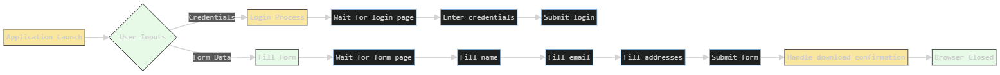

# Web Automation DemoQA GUI 


## 🌟 Overview

This project provides a **graphical user interface (GUI)** for automating web interactions on [DemoQA](https://demoqa.com/), a popular website for web automation testing. The application simplifies common browser automation tasks through an intuitive Tkinter-based interface.

### Key Features
- ✅ Log in to DemoQA with username/password
- ✅ Fill forms (Full Name, Email, Address)
- ✅ Automated browser navigation
- ✅ Visual confirmation of operations
- ✅ Simple "Close Browser" button for cleanup
- ✅ Robust element waiting (no race conditions)

## 📦 Project Structure

```
your-repo/
├── main.py           # Selenium automation core
├── gui.py            # Tkinter GUI interface
├── chromedriver-win64/
│   └── chromedriver.exe # Windows-specific ChromeDriver
├── requirements.txt  # Dependency specifications
└── README.md         # This file
```

## 🔧 Installation & Setup

### Requirements
- Python 3.11+
- Chrome browser (latest version)
- ChromeDriver (match your Chrome version)
- Tkinter (standard with Python)

### Setup Steps
1. **Install dependencies**:
```bash
pip install selenium keyboard
```

2. **Download ChromeDriver**:
- Get the correct version for your Chrome: [ChromeDriver Downloads](https://chromedriver.chromium.org/downloads)
- Place the executable in `chromedriver-win64/` (Windows)
- *For macOS/Linux*: Update paths in `main.py`

3. **Run the application**:
```bash
python gui.py
```

## 🖥️ How It Works



### User Workflow
1. Enter DemoQA credentials
2. Complete form fields
3. Click "Submit" to:
   - Automatically log in
   - Fill out form
   - Handle download confirmation
4. Click "Close Browser" to terminate session

## 💻 Technical Highlights

### Core Automation Logic
```python
#sample
class WebAutomation:
    def __init__(self):
        self.driver = webdriver.Chrome(
            executable_path="chromedriver-win64/chromedriver.exe"
        )
    
    def login(self, username, password):
        self.driver.get("https://demoqa.com/login")
        # Explicit wait for login fields
        WebDriverWait(self.driver, 10).until(
            EC.element_to_be_clickable((By.ID, "userName"))
        ).send_keys(username)
        # ... (full implementation)
```

### GUI Implementation
```python
#sample
root = Tk()
root.title("DemoQA Automation")

# Login frame
login_frame = Frame(root)
login_frame.pack(pady=10)

# Form fields and buttons
Button(root, text="Submit", command=lambda: self.auto_process()).pack(pady=5)
Button(root, text="Close Browser", command=self.close_browser).pack(pady=5)
```

## ⚠️ Important Notes

1. **Windows-Specific**:
   - ChromeDriver path assumes Windows setup
   - Use `chromedriver-win64/chromedriver.exe` (Linux/macOS need path adjustments)

2. **Security Note**:
   - Credentials are handled in-memory (no persistent storage)
   - Never commit sensitive info to version control

3. **Browser Requirements**:
   - Chrome must be installed on the system
   - ChromeDriver version must match Chrome version

## 🚀 Quick Start

### Minimal Setup (Windows)
1. Install Python (includes Tkinter)
2. Install Chrome & ChromeDriver
3. Create `chromedriver-win64/` directory
4. Copy ChromeDriver to this directory
5. Run: `python gui.py`

### Running Without GUI (for testing)
```python
# In main.py
if __name__ == "__main__":
    automation = WebAutomation()
    automation.login("your_user", "your_pass")
    automation.fill_form("John", "Doe", "john@example.com", "123 Main St")
    automation.close_browser()
```

## 💬 Contributing

Pull requests are welcome! For major changes, please open an issue first to discuss.

## 📜 License

[MIT](https://choosealicense.com/licenses/mit/) © Vinay Kumar K V

---

[](https://github.com/yourusername/your-repo)
[](https://github.com/yourusername/your-repo)